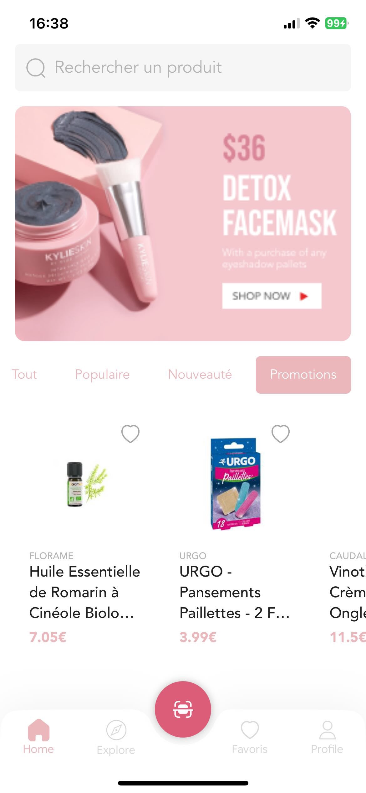
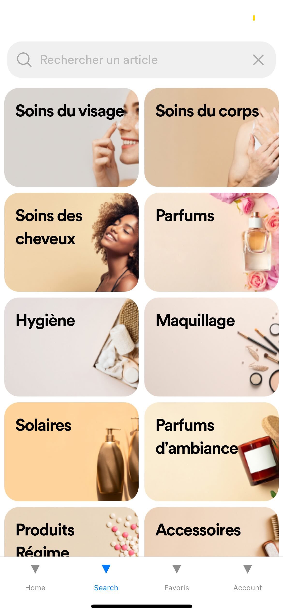
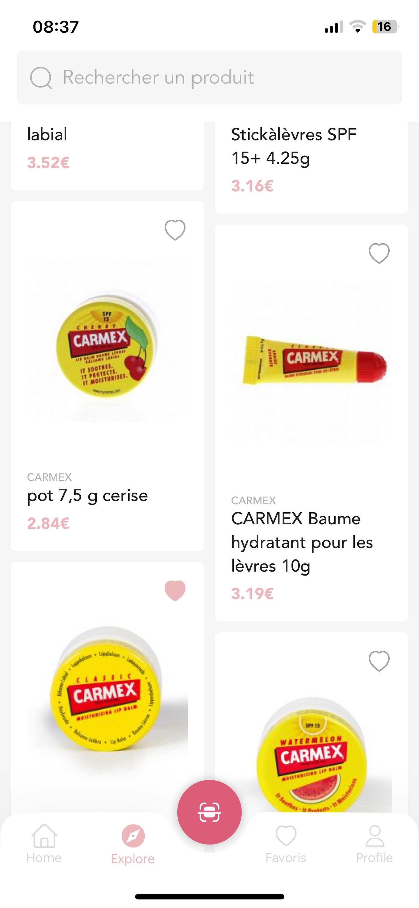
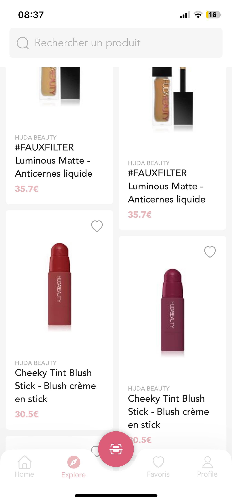

# Maquillage Comparé

Bienvenue dans Maquillage Comparé, une application de comparaison de maquillage conçue pour simplifier votre processus de recherche et d'achat de produits cosmétiques. Que vous soyez un amateur de maquillage ou un professionnel de l'industrie de la beauté, notre application est conçue pour vous offrir une expérience utilisateur intuitive et enrichissante.

## Fonctionnalités principales

- **Comparaison de produits :** Comparez facilement les caractéristiques, les prix et les avis de différents produits cosmétiques.
  
- **Recherche avancée :** Utilisez des filtres avancés pour affiner votre recherche et trouver exactement ce que vous cherchez.

- **Listes de favoris :** Ajoutez des produits à votre liste de favoris pour un accès rapide et une comparaison ultérieure.

## Technologie utilisée

- **Frontend :** L'application frontend est développée en utilisant [Expo](https://expo.dev/) avec React Native pour offrir une expérience utilisateur fluide et réactive.

- **Backend :** Notre backend est construit avec [Pocketbase](https://pocketbase.io/) pour une gestion efficace des données et une scalabilité optimale.

- **Base de données :** Nous avons accumulé une vaste collection de données sur les produits cosmétiques à partir de divers revendeurs. Actuellement, nous avons indexé entre 100 000 et 200 000 produits, ce qui nous permet de fournir des informations complètes et actualisées.

## Captures d'écran

  
  
  
  

## Développement

Le développement de cette application a pris environ 3 à 4 jours, avec un accent particulier sur le design et le backend. Pour récupérer les données des produits auprès des différents magasins, nous avons utilisé des scripts Python pour indexer une grande partie des revendeurs.
